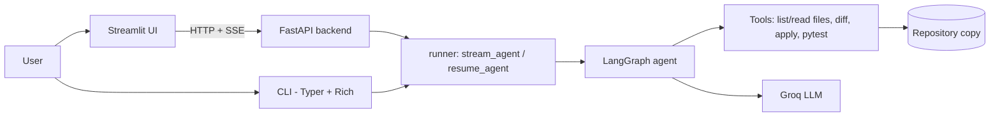

# Coding Agent

An AI coding agent that takes a coding request in plain language, finds the relevant files in a
project, proposes a plan, writes the change, runs the tests and shows a diff. **Nothing is written
to the repository until you approve it.**

| | |
|---|---|
| **Live app** | https://coding-agent-frontend.onrender.com/ |
| **API (Swagger UI)** | `<backend URL>/docs` (see [Deployment](https://coding-agent-assignment-kpyt.onrender.com/docs)) |
| **API spec** | [`docs/openapi.yaml`](docs/openapi.yaml) |
| **Approach, assumptions, limitations** | [`docs/APPROACH.md`](docs/APPROACH.md) |
| **Source** | https://github.com/Suyash-18/Coding-Agent-Assignment |

> The app runs on Render's free tier. If nobody has used it for 15 minutes it goes to sleep, so the
> first page load can take up to a minute. After a wake-up, open **Scripts → reset_demo** once to
> recreate the demo repository (the free tier does not keep files).

## What it does

Example request: *"Ensure that newly created users always have their email stored in lowercase. Add a
test proving that an uppercase email is normalized correctly."*

1. **Checks the task** (input guardrails: length, non-coding requests, prompt injection, secret-extraction).
2. **Scans the repository** and asks the model which files matter.
3. **Reads those files** and writes a **plan** (files to change, actions, assumptions).
4. **You approve or reject the plan**, optionally with a note for the model.
5. **Generates the changes**, validates them (output guardrails) and **runs the tests** in a temporary copy.
   If the tests fail, the failure output goes back to the model for another attempt (a small, fixed number of retries).
6. Shows the **diff**, test results and an **explanation** of what changed and why.
7. **You approve or decline applying** the change. Unverified changes (tests failed or none ran) are clearly marked.

## Architecture



The CLI, the API and the Streamlit app all consume the **same event stream** from
`stream_agent()` / `resume_agent()`, so there is one agent engine and three ways to use it.

Agent graph (LangGraph, with two human-approval interrupts):

```
input_guard → scan_repo → select_files → read_files → make_plan ⇄ expand_files
   → plan_approval ⏸ → generate_changes → output_guard → run_tests
        ↳ failed and retries left → generate_changes (with test output)
   → build_diff → explain → apply_approval ⏸ → apply_changes
```

## Project layout

```
src/
  coding_agent/
    runner.py        stream_agent / resume_agent and the AgentEvent contract
    cli.py           command-line interface
    api/             FastAPI backend (app, runs, jobs, repos, history, safety, schemas, settings)
    ui/              Streamlit front end (app.py, client.py, timeline.py)
    ...              graph, nodes, prompts, guardrails, tools, llm, config, run logs
  sample_project/    small FastAPI user manager used as the target of the demos
demo/sample_project/ working copy the agent edits (recreated by reset_demo)
runs/                JSON-lines log of every run
docs/                openapi.yaml, APPROACH.md
```

## Run it locally

**Requirements:** Python 3.10 or newer (see `.python-version`), [uv](https://docs.astral.sh/uv/), and a
[Groq](https://console.groq.com/) API key.

```bash
git clone https://github.com/Suyash-18/Coding-Agent-Assignment.git
cd Coding-Agent-Assignment
uv sync
```

Create a `.env` file in the project root (never commit it):

```dotenv
GROQ_API_KEY=your-key-here
MODEL_NAME=openai/gpt-oss-120b
```

The agent works on a copy of the sample project in `demo/sample_project`. If that folder does not exist
yet, start the backend (Option B below) and run **Scripts → reset_demo** (or `POST /repos/demo/reset`).
**Scripts → smoke** makes one model call to check your key and model name.

### Option A: command line

```bash
uv run python -m coding_agent run \
  --repo demo/sample_project \
  --model "openai/gpt-oss-120b" \
  --task "Add a /health endpoint with a test"
```

Flags: `--yes` (auto-approve; applies only if tests passed), `--dry-run` (never writes).
Exit codes: `0` finished, `1` error or guardrail block, `2` tests did not pass (unverified), `130` Ctrl-C.

### Option B: web app (backend + Streamlit)

Terminal 1, the API:

```bash
uv run uvicorn --factory coding_agent.api.app:create_app --port 8000
```

Terminal 2, the UI:

```bash
uv run streamlit run src/coding_agent/ui/app.py
```

The UI finds the API through the `CODING_AGENT_API_URL` environment variable
(default `http://localhost:8000`). Open http://localhost:8501, and the API docs at http://localhost:8000/docs.

### Tests

```bash
uv run pytest
```

Wherever the model is involved the tests use a fake LLM, so they need no API key.

## Using the web app

| Page | What it is for |
|---|---|
| **Run agent** | Enter a task (or click an example), watch the live timeline, approve the plan, review tests, diff and explanation, then apply or decline. |
| **Repositories** | Browse files, see changes compared with the pristine sample, reset the demo repo. |
| **History** | Every past run listed by its prompt; open one to see the plan, tests, diff and explanation again. |
| **Scripts** | `smoke` (check key and model), `reset_demo`, `check_demo` (run the demo repo's tests), `dev_run` (run the agent end to end with automatic approvals). |
| **About** | Short in-app guide to the pages. |

The sidebar chooses the model for new runs.

## Configuration

| Variable | Used by | Meaning |
|---|---|---|
| `GROQ_API_KEY` | backend, CLI | Groq API key (**required**) |
| `MODEL_NAME` | backend, CLI | Default model (`openai/gpt-oss-120b`) |
| `MODEL_NAME2` | UI, evals | Second model offered in the sidebar (`qwen/qwen3.8-27b`) |
| `CODING_AGENT_API_URL` | UI | Where the backend lives (default `https://coding-agent-assignment-kpyt.onrender.com`) |
| `AGENT_ROOT` | backend | Project root; set it on hosted services |
| `AGENT_RUNS_DIR` | backend | Run-log folder (`runs`), or `off` to disable logs |
| `API_MAX_RUNS_PER_HOUR` / `API_MAX_RUNS_PER_DAY` | backend | Rate limits (20 per client per hour, 100 per day overall) |
| `API_DECISION_TTL_S` | backend | Seconds a paused run waits for a decision (1800) |
| `API_CORS_ORIGINS` | backend | Comma-separated origins allowed by CORS |

The models the API accepts are listed in `ALLOWED_MODELS` in `src/coding_agent/api/settings.py`.

## API

The backend exposes runs, repositories, scripts and run history. Typical flow:

```bash
# 1. start a run
curl -X POST $API/runs -H "Content-Type: application/json" \
  -d '{"task": "Add a /health endpoint with a test", "repo_id": "demo"}'

# 2. follow it (Server-Sent Events); stops at each approval
curl -N $API/runs/$RUN_ID/events

# 3. approve the plan, then later the apply step
curl -X POST $API/runs/$RUN_ID/decision -H "Content-Type: application/json" \
  -d '{"stage": "plan", "action": "approve"}'

# 4. read the result or download the patch
curl $API/runs/$RUN_ID/result
curl -OJ $API/runs/$RUN_ID/patch
```

Full reference: [`docs/openapi.yaml`](docs/openapi.yaml). Paste it into https://editor.swagger.io, or open `/docs` on the running backend.

## Safety

- **Path safety:** file access is confined to the repository (no `..`, absolute paths or symlink escapes); `.git`, `.env`, binaries and oversized files are ignored.
- **Input guard:** blocks over-long, non-coding, injection and secret-extraction requests, before any model call.
- **Output guard:** checks the model's output schema, paths, file and diff size, secret patterns and protected files.
- **Human approval:** two interrupts (plan, apply); `--yes` never applies a change whose tests failed.
- **Secrets:** event payloads are redacted before they are stored or streamed; no keys are in the repository.
- **Hosted limits:** per-client and global run limits, one writer per repository, and a time limit on paused runs.

## Deployment

Both services run on [Render](https://render.com) as Python web services from this repository:

| Service | Start command |
|---|---|
| Backend | `uv run --no-sync uvicorn --factory coding_agent.api.app:create_app --host 0.0.0.0 --port $PORT` |
| Frontend | `uv run --no-sync streamlit run src/coding_agent/ui/app.py --server.port $PORT --server.address 0.0.0.0 --server.headless true` |

Build command for both: `uv sync --frozen`. Backend environment: `GROQ_API_KEY`, `MODEL_NAME`, `AGENT_ROOT`.
Frontend environment: `CODING_AGENT_API_URL` set to the backend's public `https://` URL.
Health check: `/health`.

## Known limits

See [`docs/APPROACH.md`](docs/APPROACH.md) for the approach, assumptions and limitations. In short:
the hosted demo edits one shared demo repository, state is kept in memory (a restart ends running runs),
and the free Groq tier can rate-limit model calls.